# Detailed UML - Ice Cream Trial Management

The diagram covers production classes under `src/` and excludes `src/test/java/generated`.

```mermaid
classDiagram
 direction TB

 namespace app {
  class Main {
   +main(String[] args)
  }
 }

 namespace consoleMenu {
  class MainMenu {
   -Scanner scanner
   -AddIngredientMenu addIngredientMenu
   -AddFormulaMenu addFormulaMenu
   -AddTrialMenu addTrialMenu
   -AddSensoryEvaluationMenu addSensoryEvaluationMenu
   -SearchMenu searchMenu
   -TrialReportMenu trialReportMenu
   -SaveDataMenu saveDataMenu
   +MainMenu(...)
   +start()
   -showMenu()
  }
  class AddIngredientMenu {
   -Scanner scanner
   -IngredientService ingredientService
   +AddIngredientMenu(...)
   +execute()
  }
  class AddFormulaMenu {
   -Scanner scanner
   -IngredientService ingredientService
   -FormulaService formulaService
   +AddFormulaMenu(...)
   +execute()
  }
  class AddTrialMenu {
   -Scanner scanner
   -FormulaService formulaService
   -TrialService trialService
   +AddTrialMenu(...)
   +execute()
  }
  class AddSensoryEvaluationMenu {
   -Scanner scanner
   -TrialService trialService
   -SensoryEvaluationService sensoryEvaluationService
   +AddSensoryEvaluationMenu(...)
   +execute()
  }
  class SearchMenu {
   -Scanner scanner
   -IngredientService ingredientService
   -FormulaService formulaService
   -TrialService trialService
   -SensoryEvaluationService sensoryEvaluationService
   +SearchMenu(...)
   +execute()
   -searchIngredient(int)
   -searchFormula(int)
   -searchTrial(int)
   -searchSensoryEvaluation(int)
  }
  class TrialReportMenu {
   -TrialService trialService
   +TrialReportMenu(TrialService)
   +execute()
  }
  class SaveDataMenu {
   -IngredientService ingredientService
   -FormulaService formulaService
   -TrialService trialService
   +SaveDataMenu(...)
   +execute()
  }
 }

 namespace service {
  class IngredientService {
   -List~Ingredient~ ingredients
   -Map~String,Ingredient~ ingredientMap
   -IFIngredientRepository ingredientRepository
   +IngredientService(IFIngredientRepository)
   +addIngredient(Ingredient) boolean
   +findIngredientById(String) Ingredient
   +findIngredientsByName(String) List~Ingredient~
   +removeIngredient(String) boolean
   +getAllIngredients() List~Ingredient~
   +saveData()
   +loadData()
  }
  class FormulaService {
   -List~Formula~ formulas
   -Map~String,Formula~ formulaMap
   -IFFormulaRepository formulaRepository
   +FormulaService(IFFormulaRepository)
   +addFormula(Formula) boolean
   +findFormulaById(String) Formula
   +findFormulasByName(String) List~Formula~
   +removeFormula(String) boolean
   +getAllFormulas() List~Formula~
   +saveData()
   +loadData(List~Ingredient~)
  }
  class TrialService {
   -List~Trial~ trials
   -Map~String,Trial~ trialMap
   -IFTrialRepository trialRepository
   -Queue~Trial~ trialsWaiting
   -Deque~Trial~ trialHistory
   +TrialService(IFTrialRepository)
   +addTrial(Trial) boolean
   +findTrialById(String) Trial
   +findTrialsByName(String) List~Trial~
   +removeTrial(String) boolean
   +getAllTrials() List~Trial~
   +addWaitingTrial(Trial)
   +getNextWaitingTrial() Trial
   +getLastAddedTrial() Trial
   +sortTrials(IFSortingStrategy, Comparator, SortDirection) List~Trial~
   +saveData()
   +loadData(List~Formula~)
  }
  class SensoryEvaluationService {
   +addSensoryEvaluationToTrial(Trial, SensoryEvaluation)
   +calculateAverageScoreTrial(Trial) double
   +findSensoryEvaluationById(Trial, String) SensoryEvaluation
   +findSensoryEvaluationsByName(Trial, String) List~SensoryEvaluation~
  }
 }

 namespace model_ingredient {
  class Ingredient {
   <<abstract>>
   -String id
   -String name
   -String unit
   -double price
   +Ingredient(String, String, String, double)
   +getId() String
   +getName() String
   +getUnit() String
   +getPrice() double
   +setName(String)
   +setUnit(String)
   +setPrice(double)
   +toString() String
  }
  class DairyIngredient {
   -double proteinPercent
   -double fatPercent
   +DairyIngredient(...)
   +getProteinPercent() double
   +getFatPercent() double
   +setProteinPercent(double)
   +setFatPercent(double)
   +toString() String
  }
  class FatIngredient {
   -double fatPercent
   -String fatSource
   +FatIngredient(...)
   +getFatPercent() double
   +getFatSource() String
   +setFatPercent(double)
   +setFatSource(String)
   +toString() String
  }
  class AdditiveIngredient {
   -String function
   -double recommendedDosage
   +AdditiveIngredient(...)
   +getFunction() String
   +getRecommendedDosage() double
   +setFunction(String)
   +setRecommendedDosage(double)
   +toString() String
  }
 }

 namespace model_formula {
  class Formula {
   -String idFormula
   -String nameFormula
   -List~FormulaItem~ itemsFormula
   +Formula(String, String)
   +getIdFormula() String
   +getNameFormula() String
   +getItemsFormula() List~FormulaItem~
   +setNameFormula(String)
   +addItem(FormulaItem)
   +removeItem(FormulaItem)
   +getTotalAmount() double
   +toString() String
  }
  class FormulaItem {
   -Ingredient ingredient
   -double amount
   +FormulaItem(Ingredient, double)
   +getIngredient() Ingredient
   +getAmount() double
   +setIngredient(Ingredient)
   +setAmount(double)
   +toString() String
  }
 }

 namespace model_trial {
  class Trial {
   -String idTrial
   -String nameTrial
   -Formula formulaTrial
   -double batchSizeTrial
   -TrialStatus statusTrial
   -List~SensoryEvaluation~ evaluationsTrial
   +Trial(...)
   +getIdTrial() String
   +getNameTrial() String
   +getFormula() Formula
   +getBatchSizeTrial() double
   +getStatusTrial() TrialStatus
   +getEvaluationsTrial() List~SensoryEvaluation~
   +setNameTrial(String)
   +setFormula(Formula)
   +setBatchSize(double)
   +setStatus(TrialStatus)
   +addEvaluation(SensoryEvaluation)
   +getAverageScoreTrial() double
   +compareTo(Trial) int
   +toString() String
  }
  class SensoryEvaluation {
   -String idEvaluation
   -String nameEvaluator
   -int tasteScore
   -int textureScore
   -int meltingScore
   +SensoryEvaluation(...)
   +getIdEvaluation() String
   +getNameEvaluator() String
   +getTasteScore() int
   +getTextureScore() int
   +getMeltingScore() int
   +setNameEvaluator(String)
   +setTasteScore(int)
   +setTextureScore(int)
   +setMeltingScore(int)
   +getAverageScore() double
   +toString() String
  }
 }

 namespace repository {
  class IFIngredientRepository {
   <<interface>>
   +save(List~Ingredient~)
   +load() List~Ingredient~
  }
  class IFFormulaRepository {
   <<interface>>
   +save(List~Formula~)
   +load(List~Ingredient~) List~Formula~
  }
  class IFTrialRepository {
   <<interface>>
   +save(List~Trial~)
   +load(List~Formula~) List~Trial~
  }
  class TextIngredientRepository {
   -String filePath
   +TextIngredientRepository(String)
   +save(List~Ingredient~)
   +load() List~Ingredient~
  }
  class TextFormulaRepository {
   -String filePath
   +TextFormulaRepository(String)
   +save(List~Formula~)
   +load(List~Ingredient~) List~Formula~
   -findIngredientInList(List~Ingredient~, String) Ingredient
  }
  class TextTrialRepository {
   -String filePath
   +TextTrialRepository(String)
   +save(List~Trial~)
   +load(List~Formula~) List~Trial~
   -findFormulaInList(List~Formula~, String) Formula
  }
 }

 namespace sorting {
  class IFSortingStrategy {
   <<interface>>
   +sort(List, Comparator, SortDirection)
  }
  class AbstractSorter {
   <<abstract>>
   #compare(Object, Object, Comparator, SortDirection) int
  }
  class BubbleSort {
   +sort(List, Comparator, SortDirection)
  }
  class InsertionSort {
   +sort(List, Comparator, SortDirection)
  }
  class SelectionSort {
   +sort(List, Comparator, SortDirection)
  }
 }

 namespace comparator {
  class TrialBatchSizeComparator {
   +compare(Trial, Trial) int
  }
  class TrialScoreComparator {
   +compare(Trial, Trial) int
  }
 }

 namespace concurrency {
  class EvaluationTask {
   -Trial trial
   -SensoryEvaluation sensoryEvaluation
   -SensoryEvaluationService sensoryEvaluationService
   -EvaluationLog evaluationLog
   +EvaluationTask(...)
   +run()
  }
  class EvaluationLog {
   -StringBuffer log
   +EvaluationLog()
   +addLog(String)
   +getLog() String
  }
 }

 namespace util {
  class Validator {
   +validateIngredientId(String)
   +validateFormulaId(String)
   +validateTrialId(String)
   +validateEvaluationId(String)
   +validateName(String, String)
   +validatePositive(double, String)
   +validateSensoryScore(int, String)
   +validateSearchKeyword(String)
  }
  class IngredientFactory {
   +createIngredient(String[]) Ingredient
  }
  class ReportGenerator {
   +generateTrialReport(List~Trial~) String
  }
  class SortBenchmark {
   +messure(List, IFSortingStrategy, Comparator, SortDirection) long
  }
 }

 namespace exception {
  class IceCreamException {
   <<exception>>
   +IceCreamException(String)
  }
  class FileDataException {
   +FileDataException(String)
  }
  class InvalidDataException {
   +InvalidDataException(String)
  }
  class InvalidSearchDataException {
   +InvalidSearchDataException(String)
  }
  class DuplicateIdException {
   +DuplicateIdException(String)
  }
 }

 namespace type {
  class IngredientType {
   <<enumeration>>
   DAIRY
   FAT
   ADDITIVE
  }
  class SortDirection {
   <<enumeration>>
   ASCENDING
   DESCENDING
  }
  class TrialStatus {
   <<enumeration>>
   PLANNED
   IN_PROGRESS
   COMPLETED
   CANCELLED
  }
 }

 Main --> MainMenu
 Main --> IngredientService
 Main --> FormulaService
 Main --> TrialService
 Main --> SensoryEvaluationService

 MainMenu *-- AddIngredientMenu
 MainMenu *-- AddFormulaMenu
 MainMenu *-- AddTrialMenu
 MainMenu *-- AddSensoryEvaluationMenu
 MainMenu *-- SearchMenu
 MainMenu *-- TrialReportMenu
 MainMenu *-- SaveDataMenu

 AddIngredientMenu --> IngredientService
 AddFormulaMenu --> IngredientService
 AddFormulaMenu --> FormulaService
 AddTrialMenu --> FormulaService
 AddTrialMenu --> TrialService
 AddSensoryEvaluationMenu --> TrialService
 AddSensoryEvaluationMenu --> SensoryEvaluationService
 SearchMenu --> IngredientService
 SearchMenu --> FormulaService
 SearchMenu --> TrialService
 SearchMenu --> SensoryEvaluationService
 TrialReportMenu --> TrialService
 TrialReportMenu --> ReportGenerator
 SaveDataMenu --> IngredientService
 SaveDataMenu --> FormulaService
 SaveDataMenu --> TrialService

 Ingredient <|-- DairyIngredient
 Ingredient <|-- FatIngredient
 Ingredient <|-- AdditiveIngredient
 Formula *-- FormulaItem
 FormulaItem --> Ingredient
 Trial --> Formula
 Trial *-- SensoryEvaluation
 Trial --> TrialStatus

 IngredientService --> IFIngredientRepository
 FormulaService --> IFFormulaRepository
 TrialService --> IFTrialRepository
 TrialService --> IFSortingStrategy
 TrialService --> SortDirection
 TextIngredientRepository ..|> IFIngredientRepository
 TextFormulaRepository ..|> IFFormulaRepository
 TextTrialRepository ..|> IFTrialRepository

 AbstractSorter ..|> IFSortingStrategy
 BubbleSort --|> AbstractSorter
 InsertionSort --|> AbstractSorter
 SelectionSort --|> AbstractSorter
 TrialBatchSizeComparator ..|> Comparator
 TrialScoreComparator ..|> Comparator

 EvaluationTask ..|> Runnable
 EvaluationTask --> Trial
 EvaluationTask --> SensoryEvaluation
 EvaluationTask --> SensoryEvaluationService
 EvaluationTask --> EvaluationLog

 IngredientFactory --> IngredientType
 IngredientFactory --> DairyIngredient
 IngredientFactory --> FatIngredient
 IngredientFactory --> AdditiveIngredient
 ReportGenerator --> Trial
 SortBenchmark --> IFSortingStrategy
 SortBenchmark --> SortDirection
 Validator ..> InvalidDataException
 Validator ..> InvalidSearchDataException

 FileDataException --|> IceCreamException
 InvalidDataException --|> IceCreamException
 InvalidSearchDataException --|> InvalidDataException
 DuplicateIdException --|> IceCreamException

 TextIngredientRepository ..> IngredientFactory
 TextTrialRepository ..> TrialStatus
 TextFormulaRepository ..> FileDataException
 TextTrialRepository ..> FileDataException
 IngredientService ..> InvalidDataException
 FormulaService ..> InvalidDataException
 TrialService ..> InvalidDataException
 SensoryEvaluationService ..> InvalidDataException
```

## Relationship legend

- `--|>`: inheritance.
- `..|>`: interface implementation.
- `*--`: composition; the owner contains the lifecycle of the contained objects.
- `-->`: direct association or dependency through a field/parameter.
- `..>`: usage dependency, usually validation, utility, exception, or framework type.
